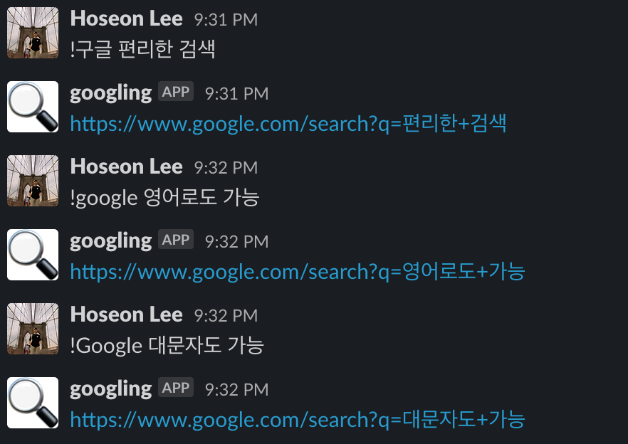

# Googling-Bot
> Slack에서 편하게(?) 구글링을 해보세요!

</img>

## Get Slack API Token

1. [Slack App Directory](https://slack.com/apps)에 들어간다.
> Workspace가 없으면 생성하세요.

2. 우측 상단 네비게이션 바 에서 Manage로 접속한 후 Custom Integrations에 들어갑니다.
3. Bots를 누르고 Add Configuration > Username 입력 > Add Bot Integration(이후에 Icon 등 여러 정보를 등록해도 됨)
4. `xoxb-... `로 시작하는게 <b>Token</b> 입니다.

## Settings

1. 이 저장소를 Clone 하기 
> git clone https://github.com/indante/Googling-Bot.git
2. `npm install` 하기
> @slack/client, dotenv, pm2 패키지를 다운받기 위해
3. `.env` 파일 생성하고 안에 `SLACK_TOKEN` 이름으로 토큰 값을 넣어주기
> `touch .env` 커맨드를 이용하면 멋지게 할 수 있음

```js
// .env

SLACK_TOKEN=xoxb-...
```

4. `pm2 start bot.js --watch` 하기
> pm2 패키지를 이용해 실시간 구동하기